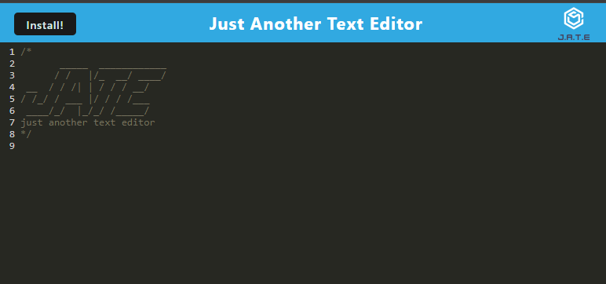
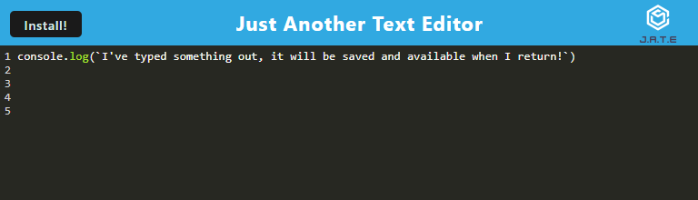

# JATE Text Editor
[Live Site URL](https://text-editor-4fwj.onrender.com/)

## Description

JATE (Just Another Text Editor) is PWA for editing and saving text directly through your browser. 

## Features

- **Write Text**: You can write text directly into the app via your chosen browser. 

- **Save Text**: It will still be there when you reload the site later!

## Technologies Used

- HTML5
- CSS3
- JavaScript
- Webpack
- Babel
- IndexedDB
- idb (IndexedDB wrapper)
- Workbox (service workers)
- Progressive Web App (PWA) standards
- Node.js
- Express.js
- Render for deployment
- Service Workers
- Manifest.json
- Webpack PWA Manifest Plugin
- InjectManifest Plugin from Workbox

## Installation

1. Clone this repository to your local machine.
2. Open the repo folder in your terminal.
3. Run `npm install` and `npm run build`, then `npm run start`.
4. Visit [localhost:3000](http://localhost:3000/) on your chosen browser and get writing!

## Usage

- To write something, simply click within the text editor box and get writing.
- It will be there when you return!
- You can also install the app locally by clicking the install button at the top right corner.

## Contributing

Contributions are welcome! If you'd like to contribute to this project, please fork the repository, make your changes, and submit a pull request with your proposed changes.

## License

This project is licensed under the [MIT License](LICENSE).

## Acknowledgments

- Special thanks to [UC Berkeley Coding Bootcamp](https://bootcamp.berkeley.edu/coding/) for providing the resources and support to help me kickstart my coding journey.